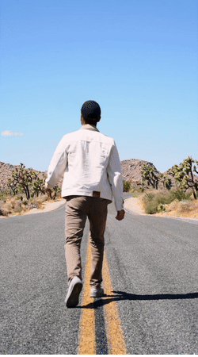
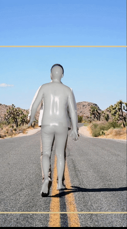
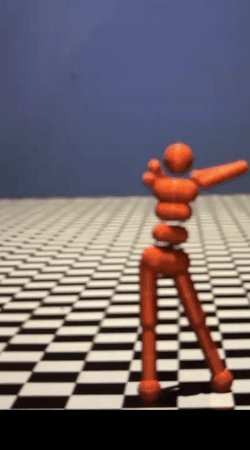
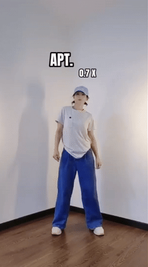
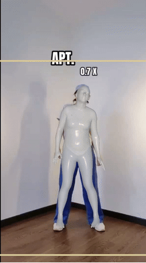
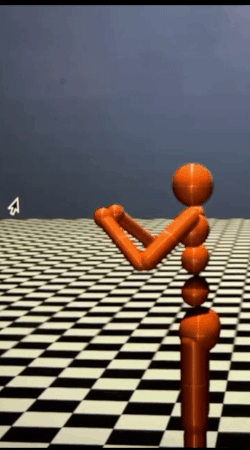
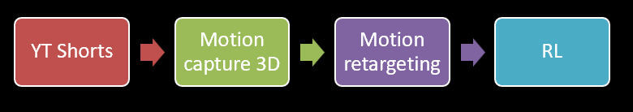
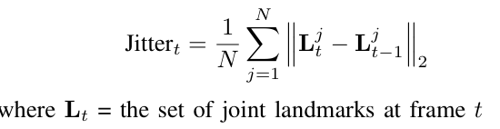
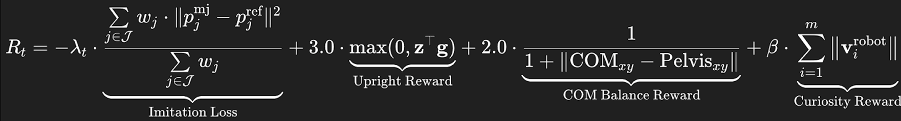

# RoboJackson: An Imitation Learning Framework for Dance
Contributors: Adithi Narayan and Priyanka Rose Vargheese

### Objective
Given a real world YouTube shorts video demonstration -> Translate it to a robot dancing

### Demo
Trained on simple laptop one a single example video. Further training can improve the model.

  
  
  

 

  
  
  

### Pipeline

1. YouTube Shorts:
   1. Search [YoutubeDL]
   2. Filter for shorts and top 5
   3. Apply MediaPipe 2D pose estimation
   4. Stability score = Joints missing per frame + Landmark jitter
   
   5. Choose minimum stability score and download
2. Motion capture 3d
   1. Hybrik
   2. NIKI
3. Motion retargetting
   1. Map joints from 3d Mocap to humanoid
   2. Interpolate and smoothen
4. Reinforcement learning
   1. TQC Algorithm
   2. Curriculum learning
   3. Reward function
   

Check the paper [Link](/Robojackson%20-%20final%20report.pdf) for detailed insights!